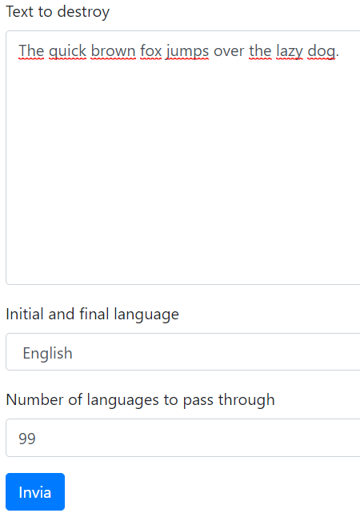

# GoogleTranslateDestroyer
Ever wanted to put something into Google Translate and pass it through every single language, just to see what you'd end up with? No? Well, we made a web page for it anyway.

## Installation
Install [Python](https://www.python.org/) (at least version 3)

## Starting
To start Django's web server, open a command prompt and go to the directory where you cloned or downloaded the repository, then type the following command:
- Windows:
```
py manage.py runserver
```

- Linux / macOS:
```
python3 manage.py runserver
```


## Usage
After the server has been started, you can direct your web browser to [http://localhost:8000](http://localhost:8000) to see the following page:


Insert some text into the first textarea that you'd like to **destroy**, choose the language in which the text is (which is also the language of the text that will be returned to you at the end), choose a number of languages in which to translate the text from 1 to 99 and click "Send".



Depending on the chosen number of languages the operation will take more or less time, count an average of 1.3 seconds per language.

You can check the console with which you started the application for step-by-step updates on your text as it gets translated in every language.  


After some time the textarea labeled "Output" will contain your text after it's been ridiculously destroyed by Google Translate.

